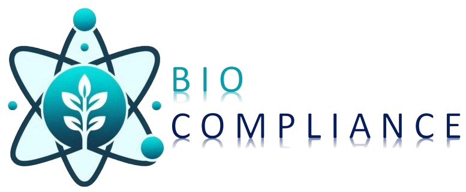

# Bio Compliance - Landing Page



Este es el repositorio oficial de la landing page de **Bio Compliance**, una consultora dedicada a ofrecer asesoría experta para el crecimiento y cumplimiento normativo de negocios. La página está diseñada para ser moderna, atractiva y completamente responsive.

## ✨ Características Principales

- **Diseño Moderno y Atractivo:** Una interfaz de usuario limpia y profesional que refleja la calidad de los servicios ofrecidos.
- **Totalmente Responsive:** Perfecta visualización en cualquier dispositivo, desde ordenadores de escritorio hasta teléfonos móviles.
- **Secciones Clave:**
  - **Inicio:** Una bienvenida con un carrusel de imágenes y un llamado a la acción claro.
  - **Nosotros:** Presentación del equipo y la misión de la empresa.
  - **Servicios:** Descripción detallada de los servicios ofrecidos, como asesoría personalizada y cumplimiento normativo.
  - **Testimonios:** Opiniones de clientes satisfechos para generar confianza.
  - **Contacto:** Un formulario de contacto funcional y datos de contacto directo.
- **Animaciones Sutiles:** Efectos de `FadeIn` para una experiencia de usuario más fluida y agradable.

## 🛠️ Tecnologías Utilizadas

- **[Next.js](https://nextjs.org/):** Framework de React para construir aplicaciones web rápidas y escalables.
- **[React](https://react.dev/):** Biblioteca de JavaScript para construir interfaces de usuario.
- **[Tailwind CSS](https://tailwindcss.com/):** Framework de CSS para un diseño rápido y personalizable.
- **[Shadcn/ui](https://ui.shadcn.com/):** Colección de componentes de UI reutilizables.
- **[Lucide React](https://lucide.dev/):** Biblioteca de iconos SVG limpios y consistentes.
- **[Embla Carousel](https://www.embla-carousel.com/):** Carrusel ligero y extensible para React.

## 🚀 Instalación y Uso

Sigue estos pasos para levantar el proyecto en tu entorno local:

1.  **Clona el repositorio:**
    ```bash
    git clone https://github.com/tu-usuario/biocompliance.git
    cd biocompliance
    ```

2.  **Instala las dependencias:**
    ```bash
    npm install
    ```

3.  **Ejecuta el servidor de desarrollo:**
    ```bash
    npm run dev
    ```

4.  **Abre tu navegador:**
    Visita [http://localhost:3000](http://localhost:3000) para ver la aplicación en funcionamiento.

## 📞 Contacto

Si tienes alguna pregunta o quieres saber más sobre nuestros servicios, no dudes en contactarnos:

- **Email:** [contacto@biocompliance.cl](mailto:contacto@biocompliance.cl)
- **Teléfono:** +56 9 5969 7543

